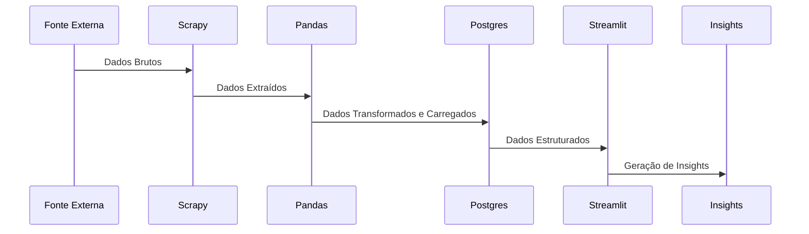

# Arquiteturas

## Fluxo da ETL

Fluxo de sequencia de diagrama simplificado

```mermaid
sequenceDiagram
    participant Fonte Externa
    participant Scrapy
    participant Pandas
    participant Postgres
    participant Streamlit
    participant Insights

    Fonte Externa->>Scrapy: Dados Brutos
    Scrapy->>Pandas: Dados Extraídos
    Pandas->>Postgres: Dados Transformados e Carregados
    Postgres->>Streamlit: Dados Estruturados
    Streamlit->>Insights: Geração de Insights
```